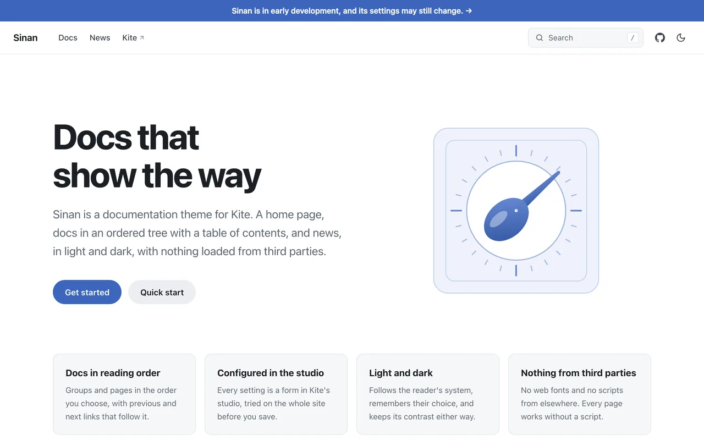

# Sinan

Sinan is a documentation theme for [Kite](https://github.com/kite-plus/kite):
a home page, documents in a tree with their own order, news, and search, in
light and dark. It is named after 司南, the south-pointing spoon of ancient
China and an early form of the compass.



It is the theme [www.kite.plus](https://www.kite.plus) is to be built with,
and the second theme written against Kite's theme contract, which freezes
once a theme this different from the default one has been written.

Sinan lives only in this repository. Kite ships just its default theme and
does not bundle this one.

## Using it

Drop the zip of a release on the upload tile under **Settings → Theme** in
Kite's studio, or unzip it into a site's `themes` folder and set `theme.name`
to `sinan` in `kite.yaml`. Then list the docs in the docs tree, the way
[the example site's kite.yaml](example/kite.yaml) does. Every setting is
described in [the settings reference](example/content/pages/settings-reference.md).

Sinan asks for Kite 0.1 or later.

## Developing it

[`example/`](example) is a Kite site that uses the theme through a link,
`themes/sinan` to the root of this repository, and that documents the theme
at the same time:

```sh
cd example
kite run
```

A change is ready when both of these pass:

```sh
kite theme verify .
(cd example && kite build --verify)
```

## Releasing

`scripts/package.sh` packs `dist/sinan-<version>.zip`, one folder named
`sinan` holding `theme.yaml` and what the theme is made of, which the studio
installs as it is. Tag the release and attach the zip.

## Design

The plan, with what Kite has to add for the rest of it, is in
[docs/design/README.md](docs/design/README.md).

## License

[Apache License 2.0](LICENSE).
